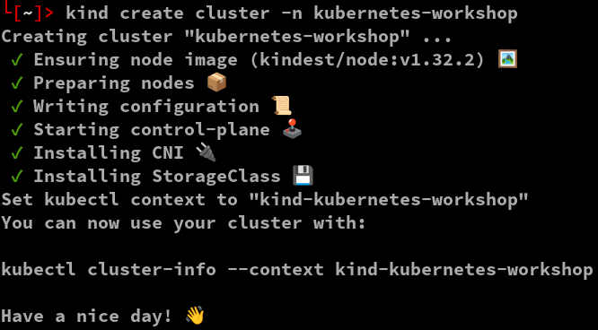

# kubernetes-workshop

## Start Kind and configuration

To start your Kind cluster : 

```
kind create cluster -n kubernetes-workshop
```

You should see the result as this 



You can have a look at your Kubernetes cluster components:

```
> kubectl get nodes
> kubectl -n kube-system get pod
```